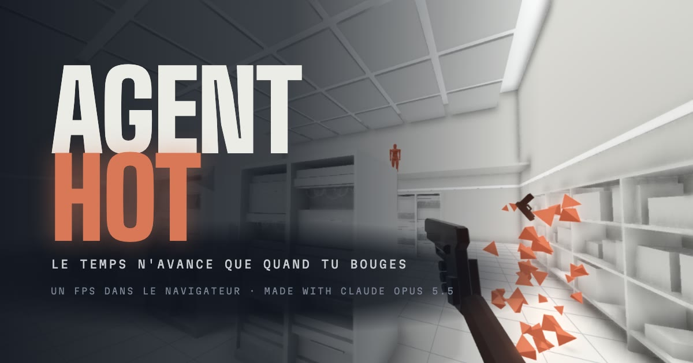

# AGENTHOT

Un FPS dans le navigateur où le temps n'avance que quand tu bouges. Une salle, cinq ennemis, quatre balles.

**Jouer : https://agenthot.erom.cloud/**

Sur ordinateur, au clavier et à la souris. Chrome, Safari ou Firefox récents.



## Commandes

| Touche | Action |
| :--- | :--- |
| `ZQSD` ou `WASD` | Se déplacer |
| `Espace` | Sauter |
| `C` | S'accroupir |
| Clic gauche | Tirer. Mains vides : coup de poing |
| Clic droit | Lancer l'arme |
| `E` | Ramasser une arme |
| `Échap` | Pause |
| `R` | Recommencer |

Une seule touche et tu meurs. Aucun ennemi ne tire sans avoir visé : le trait orange prévient toujours.

## Comment c'est fait

AGENTHOT est une vitrine technique de Claude Opus 5.5. Le code, les plans et les revues ont été écrits par Claude, pilotés par eRom. Tout le chantier est lisible dans `docs/superpowers/` : la spec, les plans, les revues.

- **Rendu :** Three.js r186, WebGPU avec repli WebGL2, matériaux et post-traitement en TSL.
- **Simulation :** physique, ennemis et replay écrits à la main en TypeScript, sans moteur externe.
- **Son :** Web Audio. Les bruitages sont synthétisés en code. Les musiques viennent de Lyria 3.5.
- **Images :** l'image de partage et la vignette de la salle 1 sont des captures du jeu. La vignette de la salle 2 vient de Nano Banana 2. La cinématique est montée avec Hyperframes, à partir de séquences filmées par le jeu lui-même.
- **Outils :** Vite, TypeScript, bun.

## Lancer en local

```bash
bun install
bun run dev
```

Puis ouvrir http://localhost:5173/. Les tests : `bun test`.

## Crédits

Author: eRom. Made with: Claude Opus 5.5.

Polices : Big Shoulders Display, Chakra Petch et Martian Mono, sous licence SIL Open Font License 1.1 (`public/fonts/LICENSES.txt`).
